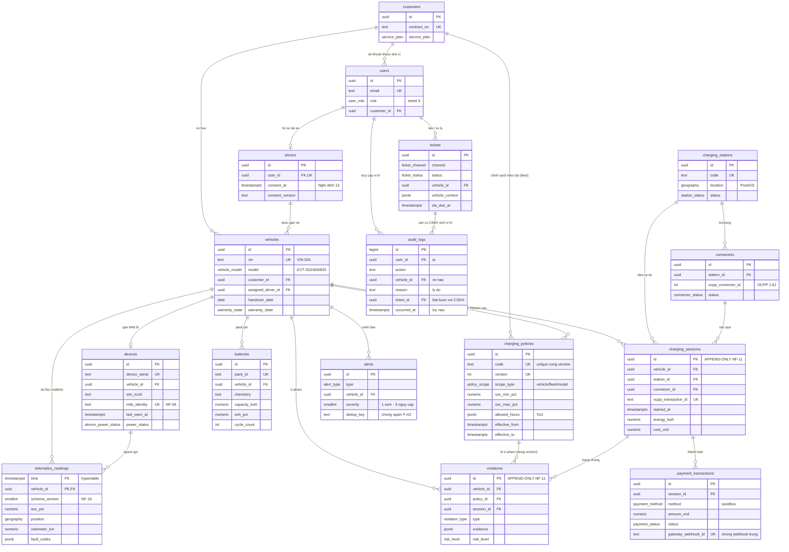

# Mô hình dữ liệu Phase 1 (F-G4)

> Nguồn yêu cầu: `docs/prd/08-du-lieu-tich-hop.md` (sheet 8, PRD v2.0).
> Schema nằm ở `packages/db/migrations/` (đánh số 0001–0012, quy tắc 9).
> Types TypeScript sinh từ schema: `npm run db:types` → `packages/shared/src/db-types.ts`.

## Nguyên tắc thiết kế

- **Append-only (NF-11):** `charging_sessions` và `violations` có trigger DB
  (`forbid_update_delete`) chặn mọi UPDATE/DELETE — bằng chứng pháp lý bảo hành bất biến.
  Vì vậy liên kết thanh toán đi theo chiều `payment_transactions.session_id`
  (phiên sạc không bao giờ phải sửa sau khi ghi).
- **Schema versioning (NF-16):** `telematics_readings.schema_version` có từ ngày 1,
  khớp hằng `TELEMETRY_SCHEMA_VERSION` ở `@g3/shared`. Đổi schema = migration mới + tăng version.
- **Retention (NF-16):** `telematics_readings` là hypertable TimescaleDB, retention hot
  mặc định 12 tháng, cấu hình qua `TELEMETRY_RETENTION_MONTHS` (áp khi `npm run db:migrate`).
  Cold 5 năm sẽ xử lý ở pipeline ETL (F-G3, giai đoạn sau).
- **Nghị định 13/2023:** `drivers.consent_at` + `drivers.consent_version` ghi nhận đồng ý
  xử lý dữ liệu cá nhân; `audit_logs` ghi mọi truy cập vị trí xe (ai, lúc nào, xe nào, lý do;
  CSKH bắt buộc kèm `ticket_id` đang mở — NF-06, sheet 9).
- **PostGIS:** `geography(Point, 4326)` cho vị trí trạm (`charging_stations.location`)
  và GPS telematics (`telematics_readings.position`).
- **Chống trùng/trễ:** khóa chính `(vehicle_id, time)` của telematics chặn bản ghi trùng
  (ingest dùng `ON CONFLICT DO NOTHING`); dữ liệu đến trễ (timestamp quá khứ) ghi bình thường.
  `payment_transactions.gateway_webhook_id UNIQUE` chống webhook đến 2 lần.

## Đối chiếu thực thể sheet 8 → bảng

| Thực thể sheet 8 | Bảng | Ghi chú |
|---|---|---|
| Xe (Vehicle) | `vehicles` | VIN giả, dòng `EVT-262/400/825`, chủ xe (`customer_id`), tài xế gán, bàn giao, bảo hành, gói |
| Thiết bị (Device) | `devices` | firmware, SIM/ICCID, `last_seen_at`, trạng thái nguồn, `mtls_identity` + `revoked_at` (NF-06) |
| Pin (Battery) | `batteries` | pack_id, hóa chất, dung lượng, SOH, chu kỳ (SOC/điện áp/nhiệt độ realtime nằm ở telematics) |
| Bản ghi telematics | `telematics_readings` | hypertable; `schema_version`; SOC, GPS, tốc độ, odometer, nhiệt độ, mã lỗi |
| Phiên sạc (ChargingSession) | `charging_sessions` | **append-only**; kWh, SOC đầu/cuối, công suất, chi phí VNĐ, `ocpp_transaction_id` |
| Giao dịch thanh toán | `payment_transactions` | VNPay/Momo/ví (sandbox), trạng thái, mã đối soát cổng, idempotency webhook |
| Trạm sạc (ChargingStation) | `charging_stations` | GPS PostGIS, khu vực, công suất, CCS2, giờ hoạt động, trạng thái |
| Trụ/Súng (Connector) | `connectors` | công suất, chuẩn, trạng thái `Available/Charging/Faulted/Unavailable` (OCPP) |
| Chính sách sạc (ChargingPolicy) | `charging_policies` | version + `(code, version)` unique; phạm vi xe/đội/dòng; ToU; SOC min–max; hiệu lực từ–đến |
| Vi phạm (Violation) | `violations` | **append-only**; `evidence` jsonb (snapshot phiên + ngưỡng chính sách), mức nguy cơ |
| Người dùng / Khách hàng / Tài xế | `users` / `customers` / `drivers` | vai trò sheet 9; hợp đồng + gói; consent Nghị định 13 |
| Cảnh báo (Alert) | `alerts` | loại phân cấp (F-A2/A4/J1/J3), `dedup_key` chống spam |
| Ticket | `tickets` | kênh (in-app/hotline/Zalo/SOS), SLA, ngữ cảnh xe jsonb |
| Audit log vị trí | `audit_logs` | NF-06 — không có trong sheet 8 nhưng bắt buộc theo sheet 9/quy tắc 5 |
| Bản tin telemetry hỏng | `telemetry_quarantine` | F-G1 — bản tin sai schema/VIN lạ cách ly kèm lý do, KHÔNG drop lặng lẽ (ADR-004); alert `data_quality` dedup 1 lần/giờ |
| Phiên OCPP đang mở | `ocpp_transactions` | F-G2 — bảng MUTABLE của CSMS (ADR-005): meter/SoC cập nhật theo MeterValues; StopTransaction mới tổng hợp thành 1 dòng `charging_sessions` bất biến |
| Thông báo đã gửi | `notifications` | F-F3 — vừa là hộp thư in-app vừa là lịch sử gửi mọi kênh; `status` gồm `suppressed` (bị rate-limit chặn, xem ADR-008) |
| Cấu hình kênh thông báo | `notification_prefs` | F-F3 — (loại alert × vai trò) → kênh + `min_severity`; chép từ sheet 9, có dòng mặc định cài sẵn trong migration |
| Token đẩy thiết bị | `push_tokens` | F-F3 — token FCM GIẢ ở Phase 1, thu hồi bằng `revoked_at` |
| Vùng geofence | `geofences` / `geofence_states` | F-A5 — đa giác `geography(Polygon,4326)` theo XE/ĐỘI/toàn hệ; bảng trạng thái giữ "đang trong hay ngoài" của từng (vùng, xe) để chỉ CHUYỂN TIẾP mới sinh cảnh báo, sống sót khi ingest restart |
| Luật bất thường pin | `anomaly_rules` | F-A4 — nhiệt độ / sụt áp / mã lỗi BMS, phạm vi XE > ĐỘI > mặc định; ⚠️ ba con số mặc định CHƯA được nhà sản xuất pin thẩm định (ADR-009, Q1 MỞ) |
| Ngưỡng cảnh báo pin | `battery_alert_thresholds` | F-A2 — ngưỡng 30/20/10 cấu hình theo XE > ĐỘI > mặc định toàn hệ; kèm biên trễ chống rung (ADR-006) |
| (P2) Lô hàng · Ghép nối · Đơn · Cước | — | ngoài phạm vi Phase 1, chưa dựng bảng |

## Sơ đồ ERD

## Lệnh vận hành

| Việc | Lệnh |
|---|---|
| Chạy migration (+ áp retention từ env) | `npm run db:migrate` |
| Seed dữ liệu giả (20 xe, 6 trạm × 4 trụ, 7 tài khoản, 2 chính sách) | `npm run db:seed` |
| Sinh lại types sau migration mới | `npm run db:types` |
| Test DB (tự tạo database `g3_test` riêng) | `npm test -w packages/db` |
