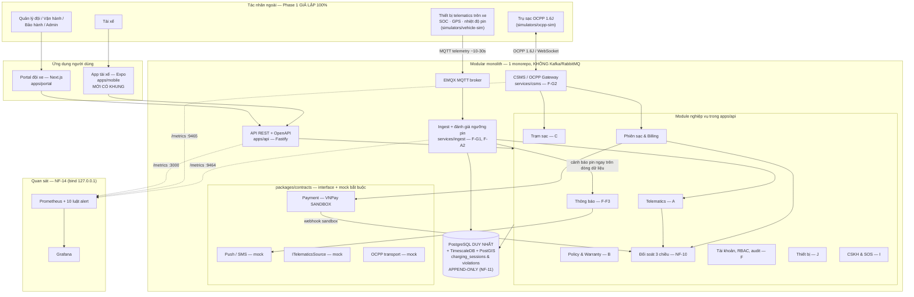
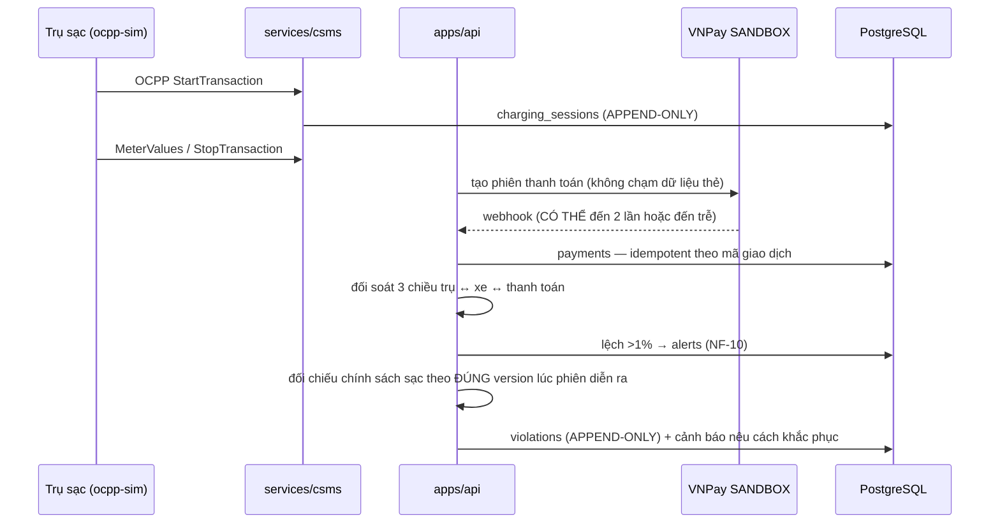

# G3 Network Phase 1 — Tổng quan hệ thống cho nhà thầu

> **Đọc file này đầu tiên.** Nó trả lời: hệ thống làm gì, ghép bằng gì, chạy thế nào,
> và ranh giới của những gì đã có. Sau đó đọc [feature-status.md](feature-status.md)
> (cái gì đã xong tới mức nào) rồi [sow/](sow/) (gói thầu của bạn).
>
> Điều kiện làm việc & chuẩn nộp bài: `standards/INPUT-05-nha-thau.md` của prompt-kit
> và [CLAUDE.md](../../CLAUDE.md) ở gốc repo. Cả hai đều bắt buộc.

---

## 1. Hệ thống này là gì

Nền tảng vận hành xe tải điện, gồm ba mảng dính chặt vào nhau:

| Mảng | Vì sao tồn tại | Rủi ro nếu sai |
|---|---|---|
| **Telematics xe–pin** → cảnh báo pin 30/20/10% | Không xe nào được hết pin giữa hành trình | AN TOÀN (cháy nổ pin), xe chết dọc đường |
| **Chính sách sạc → bằng chứng vi phạm** | Bảo vệ bảo hành 500.000km/5 năm bằng dữ liệu | PHÁP LÝ — bản ghi là chứng cứ đối chiếu hợp đồng |
| **Trạm sạc OCPP → thanh toán → đối soát 3 chiều** | Bán điện và thu đúng số tiền | TIỀN — lệch kWh >1% là thất thoát doanh thu |

Ba đặc tính này chi phối mọi quyết định kỹ thuật trong repo. Đặc biệt:
`charging_sessions` và `violations` là **APPEND-ONLY, chặn bằng trigger ở tầng DB**
(NF-11) — không phải quy ước, mà là ràng buộc kỹ thuật; và **mọi truy cập vị trí xe
phải ghi audit log** (quy tắc 5, Nghị định 13/2023).

**Trạng thái hiện tại: KHUNG chạy trên SIMULATOR.** Chưa có phần cứng thật, chưa có
tiền thật, chưa có VIN thật. Thanh toán chỉ chạy môi trường SANDBOX — `packages/payments`
có rào chắn kỹ thuật từ chối khởi động nếu URL không phải sandbox.

---

## 2. Kiến trúc

Sơ đồ đầy đủ (bản gốc, kèm chú thích hiệu chỉnh so với bản vẽ thiết kế):
[docs/architecture/system-overview.mmd](../architecture/system-overview.mmd) ·
giải thích từng khối: [docs/architecture/system-overview.md](../architecture/system-overview.md).



**Bốn quyết định kiến trúc đã CHỐT — đổi phải qua ADR được duyệt** (13 ADR tại [docs/adr/](../adr/)):

1. **Modular monolith**, không microservices. `services/ingest` và `services/csms` tách ra
   chỉ vì giao thức MQTT/WebSocket chạy dài, vẫn dùng chung DB và `packages/contracts`.
2. **Một PostgreSQL duy nhất** + extension TimescaleDB (time-series) + PostGIS (không gian).
   Không Redis riêng, không time-series DB riêng.
3. **Cảnh báo pin sinh trong `services/ingest`**, ngay trên dòng dữ liệu — không dùng job
   quét định kỳ. Đây là cách duy nhất đạt "cảnh báo ≤30s khi chạm ngưỡng" (F-A2).
4. **Mọi tích hợp ngoài đi qua interface trong `packages/contracts`**, mỗi interface có ít
   nhất 1 mock chạy được (quy tắc 2). Ba file duy nhất được chạm thư viện ngoài đều tự khai
   báo điều đó ở đầu file: `mqtt-source.ts`, `ws-server.ts`, `csms-client.ts`.

---

## 3. Luồng dữ liệu

### 3.1 Luồng an toàn — telemetry → cảnh báo pin

```
vehicle-sim → MQTT (EMQX) → services/ingest
                               ├── validate.ts   → sai định dạng / thiếu múi giờ → telemetry_quarantine
                               ├── telematics_readings (hypertable, có schema_version)
                               ├── battery-alerts.ts → ngưỡng 30/20/10% → alerts
                               ├── anomaly.ts        → nhiệt độ, sụt áp     → alerts + snapshot
                               └── geofence.ts       → ra/vào vùng          → alerts
                                              ↓
                                    packages/notify → push/SMS mock (rate-limit 3 tin/15 phút)
```

Chống spam theo **vòng đời cảnh báo**, không theo "chuyến": mỗi ngưỡng bắn đúng 1 lần cho
tới khi SOC hồi lên trên ngưỡng + 5% (ADR-006, D-03). Trạng thái nằm trong bảng `alerts`
nên sống sót qua restart của ingest.

### 3.2 Luồng tiền & bảo hành



Hai chỗ dễ làm sai mà repo đã khoá bằng test:

- **Webhook đến 2 lần** hoặc **đến trước khi phiên đóng** → vẫn đúng một giao dịch.
- **Đổi chính sách sang v2** → phiên sạc cũ vẫn bị đối chiếu theo v1 (ADR-010, F-B1).

### 3.3 Luồng quyền & riêng tư

RBAC **mặc định TỪ CHỐI**: có test quét mọi route đã đăng ký, route nào không khai
`public` / `authenticated` / `permission` thì test đỏ (`apps/api/src/app.test.ts`).
Tài xế chỉ thấy xe được gán, quản lý đội chỉ thấy đội mình.
Mỗi lần đọc vị trí xe qua API ghi một dòng `audit_logs`: ai · lúc nào · xe nào · lý do.

> Có **một lỗ hổng đã biết** ở luồng này: `GET /alerts` trả về vị trí xe mà không ghi
> audit — mục N-01 trong [debt-register.md](debt-register.md), thuộc phạm vi SOW-01.

---

## 4. Stack

| Lớp | Công nghệ | Ghi chú |
|---|---|---|
| Ngôn ngữ | TypeScript strict, Node.js ≥ 22 | Toàn bộ repo, không ngoại lệ |
| API | Fastify 5 + TypeBox → OpenAPI tự sinh | ADR-001 / D-04 |
| DB | PostgreSQL 16 + TimescaleDB + PostGIS | 29 migration đánh số; cấm sửa file đã merge |
| MQTT | EMQX (Docker) | Telemetry xe |
| OCPP | CSMS tự xây, 1.6J qua WebSocket, tham chiếu SteVe | ADR-005 |
| Portal | Next.js (App Router) | `apps/portal`, cổng 3100 |
| Mobile | React Native + Expo, ưu tiên Android tầm trung (NF-13) | `apps/mobile` — **mới có khung** |
| Thanh toán | VNPay **sandbox**, ký HMAC-SHA512 bằng `node:crypto` | Không SDK ngoài, không dữ liệu thẻ |
| Quan sát | Prometheus + Grafana, 10 luật cảnh báo | NF-14 · `infra/monitoring` |
| Test | Vitest — **622 test / 67 file, xanh toàn bộ** | Đo ngày 2026-08-20 |
| CI | GitHub Actions: lint + test + gitleaks **toàn bộ lịch sử git** | `.github/workflows/ci.yml` |

Monorepo npm workspaces: `apps/*` · `packages/*` · `services/*` · `simulators/*` · `tools/*`.

---

## 5. Cách chạy — máy sạch, mục tiêu dưới 30 phút

Yêu cầu máy: **Node.js ≥ 22**, **Docker Desktop đang chạy**, **Git**.

```bash
npm install
```

```bash
docker compose -f infra/docker-compose.yml up -d
```

```bash
npm run db:migrate && npm run db:seed && npm run dev
```

`npm install` tự chạy `scripts/setup-env.mjs` sinh `infra/.env` với secret dùng một lần
(`JWT_SECRET`, `GRAFANA_ADMIN_PASSWORD`…). `infra/.env.example` **không bao giờ** chứa
giá trị thật (quy tắc 3).

| Địa chỉ | Là gì |
|---|---|
| <http://localhost:3000/docs> | OpenAPI (Swagger UI) — 61 operation |
| <http://localhost:3100> | Portal đội xe |
| <http://localhost:3001> | Grafana — dashboard "Sức khỏe hệ thống & đường dữ liệu" |

Sinh tải giả lập:

```bash
npm run sim:vehicles -- --count 20
```

```bash
npm run sim:ocpp -- --stations 3
```

---

## 6. Cách demo — ba kịch bản chạy được ngay

Mỗi lệnh tự dựng DB, tự bật service, tự tắt sạch. Không thao tác tay ở giữa.

| Lệnh | Thời lượng | Chứng minh điều gì |
|---|---|---|
| `npm run demo:gate0` | ~3 phút | Toàn bộ **tiêu chí Gate 0 ③**: 20 xe (3 kịch bản nguy hiểm chạy đồng thời) → cảnh báo pin phân cấp → phiên sạc OCPP vào bảng append-only → đối soát 3 chiều KHỚP → bơm sai 5% thì hệ thống bắt được → sửa bảng append-only thì DB từ chối → gọi API vị trí sai quyền thì 403 và vẫn vào audit log |
| `npm run demo:tuan8` | ~2 phút | **Vòng tiền & bảo hành**: sạc ngoài khung giờ → thu tiền sandbox, webhook gửi 2 lần vẫn đúng 1 giao dịch → gắn cờ vi phạm kèm bảng bằng chứng → đổi chính sách sang v2 mà phiên cũ vẫn chiếu theo v1 |
| `npm run demo:tuan11` | ~15 giây | **Một tuần của quản lý đội xe**: một màn hình tổng quan đủ bản đồ + xe + cảnh báo; quản lý đội không thấy đội khác; một lần xem bản đồ = đúng một dòng nhật ký truy cập vị trí; bàn giao xe theo VIN tới tick xanh |

**Cả ba demo đã được chạy kiểm chứng ngày 2026-08-20**, mỗi demo chạy **hai lượt liên tiếp**
để bắt lỗi chỉ lộ ra ở lần chạy thứ hai: `demo:gate0` hoàn tất (KHÔNG TRÙNG + KHÔNG SÓT, phát
hiện đúng lỗi bơm sai 5% có chủ ý) · `demo:tuan8` **9/9 tiêu chí ĐẠT** cả hai lượt ·
`demo:tuan11` **12/12 tiêu chí ĐẠT** (đã sửa một lỗi khoá ngoại chỉ xuất hiện từ lượt thứ hai
— xem mục 3b của [debt-register.md](debt-register.md)).

> ⚠️ **Reset DB trước khi demo trước mặt khách.** `npm run loadtest` để lại **300 xe** trong
> database; 280 xe trong số đó ngừng phát khi lượt đo kết thúc và bị F-J3 xếp là "nghi tháo
> thiết bị", làm mọi lượt `demo:gate0` sau đó sinh ~280 cảnh báo giả (mục **N-13**).
>
> ```bash
> docker compose -f infra/docker-compose.yml down -v && docker compose -f infra/docker-compose.yml up -d && npm run db:migrate && npm run db:seed
> ```

Đo tải (NF-04) — ghi đè [load-test-300.md](load-test-300.md):

```bash
npm run loadtest -- --vehicles 300 --stations 10 --minutes 30
```

---

## 7. Ranh giới — đọc kỹ trước khi báo giá

Những điều dưới đây **không phải thiếu sót**, mà là chỗ Phase 1 cố ý dừng lại:

- **Không có phần cứng thật.** Mọi dữ liệu xe đến từ `simulators/vehicle-sim`, mọi trụ sạc
  từ `simulators/ocpp-sim`. Từ 2026-08-21, **D-13** chốt G3 tự chọn T-BOX nên TR-02/04/05
  hết chặn (thành tiêu chí mua sắm). Thứ còn chặn thật là **file DBC** để đọc CAN — dự kiến
  8/2026, chú thích tiếng Trung, cần dịch. Xem [DECISION-LOG.md](../DECISION-LOG.md).
- **Không có tiền thật.** VNPay chỉ sandbox, có rào chắn kỹ thuật chặn URL production.
  Chưa tích hợp hóa đơn điện tử (F-H3) — nhà cung cấp (Q9) chưa chọn.
- **App tài xế mới có khung.** Có cấu hình, tầng API, đăng nhập OTP, bảng 10 màn hình và
  luật điều hướng — **chưa vẽ màn hình nào**, chờ wireframe theo
  [YEU-CAU-WIREFRAME.md](../design/YEU-CAU-WIREFRAME.md).
- **Chưa có bảo mật vận hành thật**: HTTP/MQTT trần trên localhost, chưa mTLS thiết bị
  (NF-06), chưa vault (NF-05), chưa backup (NF-15), chưa pen-test (NF-07). Hướng đi đã chốt
  ở **D-16 / [ADR-014](../adr/ADR-014-ha-tang-trien-khai-va-vault.md)**: host tại Việt Nam +
  HashiCorp Vault (KV v2 cho secret, PKI cho chứng chỉ thiết bị).
- **25 mục quyết định đang MỞ**, đếm trực tiếp trong [DECISION-LOG.md](../DECISION-LOG.md)
  ngày 2026-08-21:
  - **7 mã D-xx**: D-02, D-05, D-06, D-07, D-08, D-09, D-12
  - **18 mã Q-xx**: Q1–Q18 (toàn bộ)
  - **0 mã TR-xx** — cả 5 đã hết chặn (TR-01/TR-03 chốt 04/08; TR-02/04/05 hết chặn qua D-13)

  **Không còn nhóm nào chặn hoàn toàn một gói thầu.** Ba phụ thuộc còn lại đều có đường đi
  vòng ghi trong từng SOW: **file DBC** (SOW-02), **Q9** (SOW-03 chặng 2), **Q5** (SOW-04,
  không chặn P1.0 vì F-D2 được phép mở app bản đồ ngoài).

  Nếu một hạng mục trong SOW của bạn phụ thuộc mục MỞ thì **dừng lại và nêu ra**, không tự
  giả định — ranh giới này ghi trong CLAUDE.md và áp dụng cho nhà thầu y như cho đội nội bộ.

Danh sách nợ kỹ thuật trung thực, có mức độ và gợi ý thứ tự sửa:
**[debt-register.md](debt-register.md)** — 13 mục N-xx. Đọc trước khi ước lượng công.
